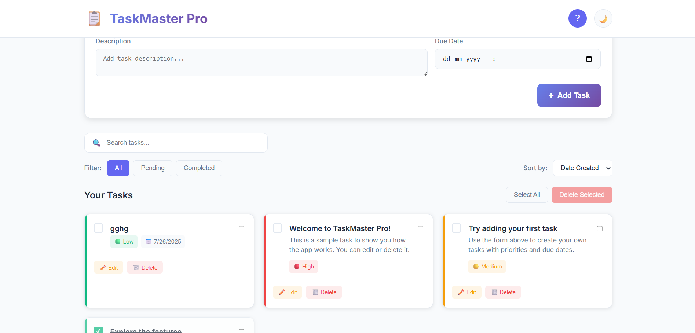

# 📋 TaskMaster Pro - Advanced To-Do List Application

**TaskMaster Pro** is a sleek and powerful to-do list web app designed to help users manage tasks efficiently with an interactive tutorial, progress tracking, and smart filters.

## 🚀 Features

- 📝 Add, edit, and delete tasks
- 🔁 Mark tasks as complete or pending
- 🎯 Filter tasks by status (All, Pending, Completed)
- 📊 Visual progress tracker
- 📅 Set task priorities and due dates
- 🔍 Live search and sorting
- ✨ Fully responsive and dark-mode supported
- 🎓 Built-in interactive tutorial overlay
- 💾 LocalStorage support (no backend needed)
- 📁 Export/Import task backup (JSON)

## 🛠 Technologies Used

- HTML5
- CSS3 (Custom Theme + Responsive Design)
- JavaScript (OOP-based)
- Google Fonts (`Inter`)
- LocalStorage API

## 📸 Screenshots

  

## 🌐 Live Demo

🔗 **[Click here to try the app!](https://deenprasath.github.io/advanced-todo-list/)**

